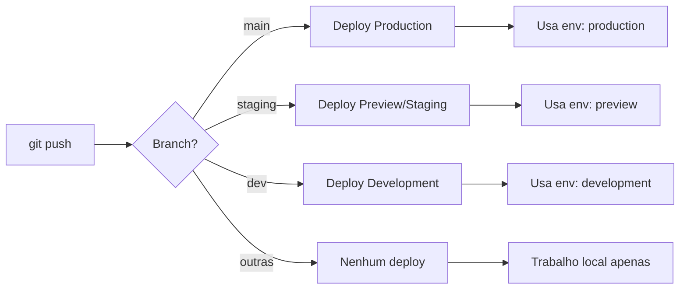

# 🚀 CI/CD - Configuração de Deploy Automatizado

## 📋 Visão Geral

Este projeto utiliza GitHub Actions + Vercel para deploy automatizado baseado em branches:

| Branch    | Ambiente              | Variáveis            | Deploy            |
| --------- | --------------------- | -------------------- | ----------------- |
| `main`    | **Production**        | Production env vars  | ✅ Automático     |
| `staging` | **Preview (Staging)** | Preview env vars     | ✅ Automático     |
| `dev`     | **Development**       | Development env vars | ✅ Automático     |
| Outras    | Local apenas          | `.env.local`         | ❌ Não faz deploy |

## 🔐 Configuração Inicial

### 1. GitHub Secrets

Adicione os seguintes secrets no GitHub:

**Caminho:** `Settings` → `Secrets and variables` → `Actions` → `New repository secret`

#### Secrets necessários:

```
VERCEL_TOKEN
VERCEL_ORG_ID
VERCEL_PROJECT_ID
```

### 2. Obter VERCEL_TOKEN

1. Acesse: https://vercel.com/account/tokens
2. Clique em **Create Token**
3. Nome: `GitHub Actions - prova-facil`
4. Scope: **Full Account**
5. Copie o token e adicione ao GitHub como `VERCEL_TOKEN`

### 3. Obter VERCEL_ORG_ID e VERCEL_PROJECT_ID

#### Opção 1: Via Vercel CLI (recomendado)

```bash
# Instale o Vercel CLI (se ainda não tiver)
pnpm add -g vercel

# Faça login
vercel login

# No diretório do projeto, execute:
vercel link

# Isso criará .vercel/project.json com os IDs
cat .vercel/project.json
```

Copie os valores:

-   `orgId` → GitHub Secret `VERCEL_ORG_ID`
-   `projectId` → GitHub Secret `VERCEL_PROJECT_ID`

#### Opção 2: Via Dashboard Vercel

1. Acesse seu projeto no Vercel Dashboard
2. `Settings` → `General`
3. **Project ID** está visível na seção "Project Settings"
4. **Org ID**: pode ser encontrado na URL ou nas configurações da conta

### 4. Configurar Variáveis de Ambiente no Vercel

#### Production (branch main)

1. Vercel Dashboard → Seu Projeto → `Settings` → `Environment Variables`
2. Para cada variável de `.env.example`, adicione:
    - **Key**: Nome da variável
    - **Value**: Valor de produção
    - **Environment**: Selecione **Production**

```env
NEXT_PUBLIC_SUPABASE_URL=https://xxx.supabase.co
NEXT_PUBLIC_SUPABASE_ANON_KEY=eyJ...
DATABASE_URL=postgresql://...
GOOGLE_AI_API_KEY=AIza...
```

#### Preview/Staging (branch staging)

1. Mesma tela de Environment Variables
2. Adicione as variáveis com valores de staging:
    - **Environment**: Selecione **Preview**

**Dica:** Use um projeto Supabase separado para staging se possível.

#### Development (branch dev)

1. Mesma tela
2. Adicione as variáveis com valores de desenvolvimento:
    - **Environment**: Selecione **Development**

**Nota:** Pode usar as mesmas variáveis de Preview ou valores de dev locais.

## 🔄 Como Funciona

### Fluxo de Deploy



### Comandos Executados

#### Production (main)

```bash
vercel pull --yes --environment=production
vercel build --prod
vercel deploy --prebuilt --prod
```

#### Preview/Staging (staging)

```bash
vercel pull --yes --environment=preview
vercel build
vercel deploy --prebuilt
```

#### Development (dev)

```bash
vercel pull --yes --environment=development
vercel build
vercel deploy --prebuilt
```

#### Feature Branches (outras)

```bash
# Nenhum comando executado
# GitHub Action mostra mensagem de skip
```

## 📝 Uso no Dia a Dia

### Deploy para Production

```bash
git checkout main
git merge staging  # ou sua branch de features
git push origin main
# ✅ Deploy automático para production
```

### Deploy para Staging (testes)

```bash
git checkout staging
git merge dev
git push origin staging
# ✅ Deploy automático para preview/staging
```

### Deploy para Development

```bash
git checkout dev
git merge feature/nova-feature
git push origin dev
# ✅ Deploy automático para development
```

### Feature Branches (sem deploy)

```bash
git checkout -b feature/minha-feature
# ... desenvolvimento local
git push origin feature/minha-feature
# ❌ Nenhum deploy (apenas local)
```

## 🧪 Testando o CI/CD

### 1. Teste com branch dev

```bash
git checkout dev
echo "test" >> README.md
git add .
git commit -m "test: CI/CD pipeline"
git push origin dev
```

### 2. Verifique o GitHub Actions

-   Vá para `Actions` no GitHub
-   Veja o workflow `Deploy to Vercel` rodando
-   Verifique os logs e o deployment URL

### 3. Acesse o ambiente

-   A URL do deploy aparece no final do workflow
-   Também aparece no Vercel Dashboard

## 🔍 Monitoramento

### GitHub Actions

-   **Caminho:** Repositório → `Actions` → `Deploy to Vercel`
-   **Logs:** Clique em qualquer workflow run para ver detalhes
-   **Status:** Badge de status pode ser adicionado ao README

### Vercel Dashboard

-   **Deployments:** Lista todos os deploys
-   **Logs:** Logs de runtime e build
-   **Analytics:** Métricas de performance

## 🐛 Troubleshooting

### "Error: Failed to deploy"

**Causa:** Secrets não configurados ou inválidos

**Solução:**

1. Verifique se todos os 3 secrets estão no GitHub
2. Verifique se o `VERCEL_TOKEN` não expirou
3. Execute `vercel link` localmente para validar IDs

### "Environment variables not found"

**Causa:** Variáveis não configuradas no Vercel para aquele ambiente

**Solução:**

1. Vá para Vercel Dashboard → Environment Variables
2. Verifique se selecionou o ambiente correto (Production/Preview/Development)
3. Adicione as variáveis faltantes

### "Build failed"

**Causa:** Erro de build (TypeScript, lint, etc.)

**Solução:**

1. Teste o build localmente: `pnpm build`
2. Corrija os erros
3. Faça commit e push novamente

### Deploy não está rodando

**Causa 1:** Branch não é main/staging/dev

**Solução:** Feature branches não fazem deploy (comportamento esperado)

**Causa 2:** GitHub Actions desabilitado

**Solução:** `Settings` → `Actions` → `General` → Habilitar workflows

## 📊 Estrutura de Ambientes Recomendada

### Production (main)

```
Database: production.supabase.co
API Keys: Production keys
Domain: prova-facil.com
```

### Staging (staging)

```
Database: staging.supabase.co (ou mesmo DB, schema diferente)
API Keys: Staging keys
Domain: staging-prova-facil.vercel.app
```

### Development (dev)

```
Database: dev.supabase.co (ou local)
API Keys: Dev keys
Domain: dev-prova-facil.vercel.app
```

## 🔒 Segurança

✅ **Boas Práticas:**

-   Nunca faça commit de secrets em `.env.local`
-   Use secrets diferentes para cada ambiente
-   Rotacione tokens periodicamente
-   Limite scope de tokens quando possível

❌ **Evite:**

-   Usar mesmas credenciais em todos ambientes
-   Expor tokens em logs
-   Compartilhar secrets via chat/email

## 📚 Referências

-   [GitHub Actions Docs](https://docs.github.com/en/actions)
-   [Vercel CLI Docs](https://vercel.com/docs/cli)
-   [Vercel Deployment Docs](https://vercel.com/docs/deployments/overview)
-   [Environment Variables Vercel](https://vercel.com/docs/projects/environment-variables)

---

**Criado em:** 01 de Outubro de 2025  
**Autor:** Tito  
**Versão:** 1.0
