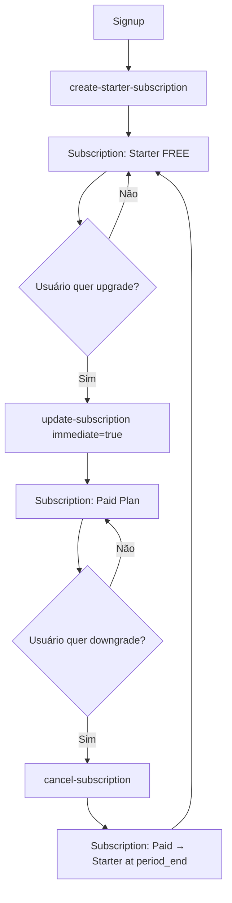

# 🔄 Arquitetura: Subscription Sempre Ativa

## 📋 Conceito

**Princípio Fundamental:** Todo usuário **SEMPRE** tem uma subscription ativa no Stripe, seja ela paga ou gratuita (Starter).

**Nunca há:**

- ❌ Subscriptions canceladas/deletadas
- ❌ Múltiplas subscriptions por customer
- ❌ Usuários sem subscription

**Sempre há:**

- ✅ Exatamente 1 subscription por customer
- ✅ Subscription ativa (status: `active` ou `trialing`)
- ✅ Plano mínimo: Starter (free)

---

## 🏗️ Arquitetura

### **Fluxo de Vida da Subscription**



### **Estados Possíveis**

| Estado                    | Plan                 | Status                        | Ação do Usuário                     |
| ------------------------- | -------------------- | ----------------------------- | ----------------------------------- |
| **Free**                  | Starter (R$ 0)       | `active`                      | Pode fazer upgrade                  |
| **Paid Active**           | Basic/Pro/Enterprise | `active`                      | Pode upgrade, downgrade ou cancelar |
| **Paid → Free Scheduled** | Basic/Pro/Enterprise | `active` (muda no period_end) | Aguardando downgrade para Starter   |
| **Trial**                 | Qualquer pago        | `trialing`                    | Período de teste                    |

**Nunca:**

- ❌ Status `canceled` ou `incomplete`
- ❌ Sem subscription

---

## 🔧 Endpoints e Comportamento

### **1. Signup: `/api/stripe/create-starter-subscription`**

**Quando:** Ao criar nova conta

**Comportamento:**

```typescript
POST /api/stripe/create-starter-subscription
Body: { userId, email, fullName }

Resultado:
- Cria Stripe customer (se não existir)
- Busca/cria price gratuito (R$ 0) para produto Starter
- Cria subscription FREE (Starter)
- Salva stripe_customer_id e stripe_subscription_id no profile
```

**Garantias:**

- ✅ Todo novo usuário sai com subscription Starter ativa
- ✅ Não cria duplicatas (verifica antes)
- ✅ Usa service role para bypass RLS

---

### **2. Upgrade: `/api/stripe/update-subscription` (immediate=true)**

**Quando:** Usuário quer plano pago melhor

**Comportamento:**

```typescript
POST /api/stripe/update-subscription
Body: { priceId: "price_basic_monthly", immediate: true }

Resultado:
- Atualiza subscription EXISTENTE para novo price
- Proration: always_invoice (cobra diferença agora)
- Mudança imediata
- Cancel_at_period_end: false (garante que não cancela)
```

**Exemplos:**

- Starter → Basic (imediato, cobra Basic)
- Basic → Pro (imediato, cobra diferença)
- Pro → Enterprise (imediato, cobra diferença)

---

### **3. Downgrade: `/api/stripe/update-subscription` (immediate=false)**

**Quando:** Usuário quer plano pago mais barato

**Comportamento:**

```typescript
POST /api/stripe/update-subscription
Body: { priceId: "price_basic_monthly", immediate: false }

Resultado:
- Agenda mudança para period_end
- Proration: none (sem cobrança agora)
- Usuário continua com plano atual até renovação
- Cancel_at_period_end: false
```

**Exemplos:**

- Enterprise → Pro (agendado para period_end)
- Pro → Basic (agendado para period_end)
- Basic → Starter (use cancel-subscription!)

---

### **4. Cancelar (Voltar para Free): `/api/stripe/cancel-subscription`**

**Quando:** Usuário quer voltar para plano gratuito

**Comportamento:**

```typescript
POST /api/stripe/cancel-subscription

Resultado:
- Busca price FREE do Starter
- Atualiza subscription para Starter FREE no period_end
- Proration: none
- Cancel_at_period_end: false (não cancela, só downgrade)
```

**IMPORTANTE:**

- ✅ NÃO deleta subscription
- ✅ NÃO deixa status=canceled
- ✅ Apenas faz downgrade para FREE Starter
- ✅ Usuário mantém acesso ao plano pago até period_end

---

### **5. Checkout: `/api/stripe/create-checkout`** (BLOQUEADO)

**Quando:** ~~Para criar nova subscription~~ **NÃO USAR**

**Comportamento:**

```typescript
POST /api/stripe/create-checkout
Body: { priceId: "price_basic_monthly" }

Resultado:
- Verifica se subscription existe
- Se existe e está ativa: HTTP 409 Conflict
- Response: { shouldRedirectToPortal: true }
- Frontend deve usar /update-subscription
```

**Uso Correto:**

- ❌ **NUNCA** para usuários com subscription existente
- ✅ Apenas se subscription foi deletada manualmente (edge case)
- ✅ Sistema normal sempre usa update-subscription

---

## 📊 Comparação: Antes vs Agora

### **ANTES (Problemático):**

```
Signup → Subscription Starter
Upgrade → Cria NOVA subscription (duplicata!)
Downgrade → Cancela subscription (status: canceled)
Cancelar → Deleta subscription (usuário sem plano)
```

**Problemas:**

- ❌ Múltiplas subscriptions por customer
- ❌ Cobranças duplicadas
- ❌ Usuários sem subscription ativa
- ❌ Inconsistência entre Stripe e DB

### **AGORA (Correto):**

```
Signup → Subscription Starter (sempre)
Upgrade → ATUALIZA subscription existente (imediato)
Downgrade → ATUALIZA subscription existente (period_end)
Cancelar → ATUALIZA para Starter FREE (period_end)
```

**Benefícios:**

- ✅ 1 subscription por customer (sempre)
- ✅ Sem cobranças duplicadas
- ✅ Todo usuário sempre tem plano ativo
- ✅ Consistência garantida

---

## 🎯 Regras de Negócio

### **Regra 1: Subscription Única**

- Cada customer_id tem exatamente 1 subscription_id
- Webhook cancela subscriptions antigas se nova for criada
- Update sempre modifica a subscription existente

### **Regra 2: Nunca Deletar**

- Subscriptions nunca são deletadas
- "Cancelar" = downgrade para Starter FREE
- Status sempre `active` ou `trialing`

### **Regra 3: Proration Inteligente**

- **Upgrade (immediate=true):** Proration always_invoice
  - Cobra diferença proporcional agora
  - Mudança imediata
- **Downgrade (immediate=false):** Proration none
  - Sem cobrança
  - Mudança no period_end

### **Regra 4: Starter é o Mínimo**

- Todo usuário tem no mínimo Starter
- Starter é FREE (R$ 0/mês)
- Starter permite features básicas

---

## 🧪 Casos de Uso

### **Caso 1: Novo Usuário**

```typescript
// 1. Signup
POST /api/stripe/create-starter-subscription
→ Subscription: Starter FREE

// 2. Quer testar Basic
POST /api/stripe/update-subscription
{ priceId: "price_basic", immediate: true }
→ Subscription: Basic R$ 19/mês (imediato)

// 3. Gostou, quer Pro
POST /api/stripe/update-subscription
{ priceId: "price_pro", immediate: true }
→ Subscription: Pro R$ 49/mês (imediato, proration da diferença)
```

---

### **Caso 2: Downgrade com Acesso Mantido**

```typescript
// Usuário está em Enterprise
// Quer downgrade para Basic

POST /api/stripe/update-subscription
{ priceId: "price_basic", immediate: false }

Resultado:
- Subscription continua Enterprise até 30/01/2025
- Em 30/01/2025: muda para Basic automaticamente
- Usuário tem acesso Enterprise completo até lá
```

---

### **Caso 3: Cancelar e Voltar para Free**

```typescript
// Usuário está em Pro
// Quer cancelar e voltar para gratuito

POST /api/stripe/cancel-subscription

Resultado:
- Subscription continua Pro até period_end
- No period_end: muda para Starter FREE
- Usuário mantém Pro até lá
- Depois: features gratuitas do Starter
```

---

### **Caso 4: Upgrade Imediato Durante Trial**

```typescript
// Usuário em trial do Pro
// Quer ativar agora (sair do trial)

POST /api/stripe/update-subscription
{ priceId: "price_pro", immediate: true }

Resultado:
- Sai do trial imediatamente
- Cobra valor cheio do Pro agora
- Status: trialing → active
```

---

## 🔍 Validações Críticas

### **No Backend:**

```typescript
// 1. Subscription existe?
if (!profile.stripe_subscription_id) {
  return { error: 'No subscription found' }; // Nunca deve acontecer!
}

// 2. Subscription está ativa?
const sub = await stripe.subscriptions.retrieve(subscriptionId);
if (sub.status !== 'active' && sub.status !== 'trialing') {
  return { error: 'Subscription not active' };
}

// 3. Já está no plano desejado?
const currentPrice = sub.items.data[0].price.id;
if (currentPrice === newPriceId) {
  return { error: 'Already on this plan' };
}

// 4. É um upgrade ou downgrade?
const isUpgrade = await comparePrice(currentPrice, newPriceId);
const immediate = isUpgrade; // Upgrade: imediato, Downgrade: agendado
```

---

## 🚨 Tratamento de Erros

### **Erro: "No active subscription found"**

**Causa:** Profile sem subscription_id (não deveria acontecer)

**Solução:**

```typescript
// Recriar subscription Starter
POST / api / stripe / create - starter - subscription;
{
  userId, email, fullName;
}
```

---

### **Erro: "Already on this plan"**

**Causa:** Usuário tentou mudar para plano atual

**Solução:**

```typescript
// Informar usuário que já está no plano
toast.info('Você já está neste plano');
```

---

### **Erro: HTTP 409 no checkout**

**Causa:** Tentou criar nova subscription quando já existe

**Solução:**

```typescript
// Usar update-subscription em vez de checkout
if (response.status === 409) {
  // Redirecionar para update-subscription
  await updateSubscription(priceId, isUpgrade);
}
```

---

## 📝 Frontend Integration

### **Hook: `use-stripe.ts`**

```typescript
const {
  updateSubscription, // Para upgrades/downgrades
  cancelSubscription, // Para voltar ao FREE
  createCheckout, // Bloqueado se já tem subscription
} = useStripe();

// Upgrade (imediato)
await updateSubscription(priceId, true);

// Downgrade (agendado)
await updateSubscription(priceId, false);

// Cancelar (downgrade para Starter FREE)
await cancelSubscription();
```

---

## 🎯 Checklist de Implementação

- [x] create-starter-subscription cria Starter FREE no signup
- [x] update-subscription atualiza subscription existente
- [x] cancel-subscription faz downgrade para Starter (não deleta)
- [x] create-checkout bloqueia se subscription existente (409)
- [x] Webhook cancela subscriptions antigas se nova for criada
- [x] Hook useStripe com cancelSubscription()
- [x] Service role client para bypass RLS
- [x] Logs detalhados em todas operações
- [x] Validações: subscription única, always active
- [x] Documentação completa

---

## 🏆 Benefícios da Arquitetura

1. ✅ **Consistência:** Sempre 1 subscription por customer
2. ✅ **Simplicidade:** Sem lógica de "criar ou atualizar"
3. ✅ **Previsibilidade:** Status sempre `active` ou `trialing`
4. ✅ **Auditoria:** Histórico completo no Stripe
5. ✅ **UX:** Downgrade preserva acesso até period_end
6. ✅ **Segurança:** Sem cobranças duplicadas
7. ✅ **Manutenção:** Código mais simples e testável

---

## 📚 Referências

- [Stripe Subscriptions API](https://stripe.com/docs/api/subscriptions)
- [Stripe Proration](https://stripe.com/docs/billing/subscriptions/prorations)
- [Stripe Webhooks](https://stripe.com/docs/webhooks)
- `/docs/SUBSCRIPTION_MANAGEMENT.md` - Detalhes técnicos
- `/docs/FRONTEND_SUBSCRIPTION_UPDATE.md` - Integração frontend

---

**Status:** ✅ **IMPLEMENTADO E ATIVO**

**Última Atualização:** 14 de Outubro de 2025
